# Trends in Above Ground Biomass in Arizona

<!-- README.md is generated from README.qmd. Please edit that file -->
<!-- badges: start -->

<!-- badges: end -->

This is a research compendium for work in progress comparing trends in
above-ground biomass in Arizona from different data products. This is a
collaboration between [CCT-Data
Science](https://datascience.cct.arizona.edu/) and the [David Moore
lab](https://djpmoore.tumblr.com/home) at University of Arizona.

## Reproducibility

### Data

The raw data are not contained in this repo and will need to be added
after you clone it. Create a `data/` folder and move the following
folders from the “snow” server to it: Chopping, ESA_CCI, Liu, LT_GNN,
and Xu. Alternatively, you may be able to run this in a way that
directly access files on snow if it is mounted—in `_targets.R`, change
`root <- "data/"` to point to the equivalent folder on the mounted
volume, e.g. `root <- "/Volumes/moore/"`

### `renv`

This project uses
[`renv`](https://rstudio.github.io/renv/articles/renv.html) for package
management. When opening this repo as an RStudio Project for the first
time, `renv` should automatically install itself and prompt you to run
`renv::restore()` to install all package dependencies.

### `targets`

This project uses the [`targets`
package](https://docs.ropensci.org/targets/) for workflow management.
Run `targets::tar_make()` from the console to run the workflow and
reproduce all results. The graph below shows the workflow:

- The project is out-of-sync – use `renv::status()` for details.

``` mermaid
graph LR
  style Legend fill:#FFFFFF00,stroke:#000000;
  style Graph fill:#FFFFFF00,stroke:#000000;
  subgraph Legend
    direction LR
    xf1522833a4d242c5([""Up to date""]):::uptodate --- xb6630624a7b3aa0f([""Dispatched""]):::dispatched
    xb6630624a7b3aa0f([""Dispatched""]):::dispatched --- xd03d7c7dd2ddda2b([""Stem""]):::none
    xd03d7c7dd2ddda2b([""Stem""]):::none --- x6f7e04ea3427f824[""Pattern""]:::none
  end
  subgraph Graph
    direction LR
    xf99622c5fc8ef45a(["ltgnn_agb"]):::uptodate --> x7e3ed8ef27617b0c(["tiles_ltgnn_agb<br>ltgnn_agb"]):::uptodate
    xd175b91b13bd123d(["az"]):::uptodate --> x7b18c44a5b46e7c6(["slope_plot_liu_agb<br>liu_agb"]):::uptodate
    x19861953fb240462(["slope_liu_agb<br>liu_agb"]):::uptodate --> x7b18c44a5b46e7c6(["slope_plot_liu_agb<br>liu_agb"]):::uptodate
    xf4e158caecdccb15(["chopping_agb"]):::uptodate --> x6768884bc669c5f9(["tiles_chopping_agb<br>chopping_agb"]):::uptodate
    xd175b91b13bd123d(["az"]):::uptodate --> xf99622c5fc8ef45a(["ltgnn_agb"]):::uptodate
    x00f89745e3b925a1(["ltgnn_files"]):::uptodate --> xf99622c5fc8ef45a(["ltgnn_agb"]):::uptodate
    x19861953fb240462(["slope_liu_agb<br>liu_agb"]):::uptodate --> x934c6d5503713b06(["summary_slope_liu_agb<br>slope_liu_agb"]):::uptodate
    xb8c4f257f8f5cc00["slope_tiles_esa_agb<br>esa_agb"]:::uptodate --> x2b62872927f90ba0(["slope_esa_agb<br>esa_agb"]):::uptodate
    x9035538e1c606cb6(["slope_chopping_agb<br>chopping_agb"]):::uptodate --> xb72891f20a5b8df1(["report"]):::uptodate
    x19861953fb240462(["slope_liu_agb<br>liu_agb"]):::uptodate --> xb72891f20a5b8df1(["report"]):::uptodate
    x3bcb242414a73cf6(["slope_xu_agb<br>xu_agb"]):::uptodate --> xb72891f20a5b8df1(["report"]):::uptodate
    x000fd996de9c9b5d(["summary_plot"]):::uptodate --> xb72891f20a5b8df1(["report"]):::uptodate
    xd175b91b13bd123d(["az"]):::uptodate --> xc1dac2c05b606c65(["slope_plot_xu_agb<br>xu_agb"]):::uptodate
    x3bcb242414a73cf6(["slope_xu_agb<br>xu_agb"]):::uptodate --> xc1dac2c05b606c65(["slope_plot_xu_agb<br>xu_agb"]):::uptodate
    x3bcb242414a73cf6(["slope_xu_agb<br>xu_agb"]):::uptodate --> x1c4a7d9fb56ed3d5(["summary_slope_xu_agb<br>slope_xu_agb"]):::uptodate
    xd175b91b13bd123d(["az"]):::uptodate --> x85cf752f78e30db8(["slope_plot_chopping_agb<br>chopping_agb"]):::uptodate
    x9035538e1c606cb6(["slope_chopping_agb<br>chopping_agb"]):::uptodate --> x85cf752f78e30db8(["slope_plot_chopping_agb<br>chopping_agb"]):::uptodate
    xd175b91b13bd123d(["az"]):::uptodate --> xf4e158caecdccb15(["chopping_agb"]):::uptodate
    x34fa7583752e3167(["chopping_file"]):::uptodate --> xf4e158caecdccb15(["chopping_agb"]):::uptodate
    xd175b91b13bd123d(["az"]):::uptodate --> x7200ced56d430735(["slope_plot_ltgnn_agb<br>ltgnn_agb"]):::uptodate
    x01a6772d1976e35e(["slope_ltgnn_agb<br>ltgnn_agb"]):::uptodate --> x7200ced56d430735(["slope_plot_ltgnn_agb<br>ltgnn_agb"]):::uptodate
    xd0c88814a818c03c["tiles_files_ltgnn_agb<br>ltgnn_agb"]:::uptodate --> x4b1136645d9b9d11["slope_tiles_ltgnn_agb<br>ltgnn_agb"]:::uptodate
    x2b62872927f90ba0(["slope_esa_agb<br>esa_agb"]):::uptodate --> xb538f1edee56fb8e(["summary_slope_esa_agb<br>slope_esa_agb"]):::uptodate
    xd175b91b13bd123d(["az"]):::uptodate --> x55cd1a25824d6c45(["xu_agb"]):::uptodate
    x4f83a8bb6986eb55(["xu_file"]):::uptodate --> x55cd1a25824d6c45(["xu_agb"]):::uptodate
    xf12eae5dccac7288["tiles_files_esa_agb<br>esa_agb"]:::uptodate --> xb8c4f257f8f5cc00["slope_tiles_esa_agb<br>esa_agb"]:::uptodate
    x1df925585a964a4f(["summary_stats"]):::uptodate --> x000fd996de9c9b5d(["summary_plot"]):::uptodate
    xfd911c6a5ce68b32(["tiles_esa_agb<br>esa_agb"]):::uptodate --> xf12eae5dccac7288["tiles_files_esa_agb<br>esa_agb"]:::uptodate
    xd175b91b13bd123d(["az"]):::uptodate --> x9126df164c036a5c(["liu_agb"]):::uptodate
    x19766d176d835c12(["liu_file"]):::uptodate --> x9126df164c036a5c(["liu_agb"]):::uptodate
    xb5861ed11a909dd6["tiles_files_chopping_agb<br>chopping_agb"]:::uptodate --> x09b7490629889bf8["slope_tiles_chopping_agb<br>chopping_agb"]:::uptodate
    x7e3ed8ef27617b0c(["tiles_ltgnn_agb<br>ltgnn_agb"]):::uptodate --> xd0c88814a818c03c["tiles_files_ltgnn_agb<br>ltgnn_agb"]:::uptodate
    xd175b91b13bd123d(["az"]):::uptodate --> x20b6251b56892c2a(["esa_agb"]):::uptodate
    x151ce04cb638b59b(["esa_files"]):::uptodate --> x20b6251b56892c2a(["esa_agb"]):::uptodate
    x9126df164c036a5c(["liu_agb"]):::uptodate --> x19861953fb240462(["slope_liu_agb<br>liu_agb"]):::uptodate
    x000fd996de9c9b5d(["summary_plot"]):::uptodate --> x14470e08f150281f(["summary_plot_png"]):::uptodate
    x4b1136645d9b9d11["slope_tiles_ltgnn_agb<br>ltgnn_agb"]:::uptodate --> x01a6772d1976e35e(["slope_ltgnn_agb<br>ltgnn_agb"]):::uptodate
    x55cd1a25824d6c45(["xu_agb"]):::uptodate --> x3bcb242414a73cf6(["slope_xu_agb<br>xu_agb"]):::uptodate
    x09b7490629889bf8["slope_tiles_chopping_agb<br>chopping_agb"]:::uptodate --> x9035538e1c606cb6(["slope_chopping_agb<br>chopping_agb"]):::uptodate
    x01a6772d1976e35e(["slope_ltgnn_agb<br>ltgnn_agb"]):::uptodate --> xa16d430869e8e273(["summary_slope_ltgnn_agb<br>slope_ltgnn_agb"]):::uptodate
    xd175b91b13bd123d(["az"]):::uptodate --> x88a086ea53d4cf03(["slope_plot_esa_agb<br>esa_agb"]):::uptodate
    x2b62872927f90ba0(["slope_esa_agb<br>esa_agb"]):::uptodate --> x88a086ea53d4cf03(["slope_plot_esa_agb<br>esa_agb"]):::uptodate
    x20b6251b56892c2a(["esa_agb"]):::uptodate --> xfd911c6a5ce68b32(["tiles_esa_agb<br>esa_agb"]):::uptodate
    x6768884bc669c5f9(["tiles_chopping_agb<br>chopping_agb"]):::uptodate --> xb5861ed11a909dd6["tiles_files_chopping_agb<br>chopping_agb"]:::uptodate
    x9035538e1c606cb6(["slope_chopping_agb<br>chopping_agb"]):::uptodate --> x0d6d34d4d7cb30cd(["summary_slope_chopping_agb<br>slope_chopping_agb"]):::uptodate
    x0d6d34d4d7cb30cd(["summary_slope_chopping_agb<br>slope_chopping_agb"]):::uptodate --> x1df925585a964a4f(["summary_stats"]):::uptodate
    xb538f1edee56fb8e(["summary_slope_esa_agb<br>slope_esa_agb"]):::uptodate --> x1df925585a964a4f(["summary_stats"]):::uptodate
    x934c6d5503713b06(["summary_slope_liu_agb<br>slope_liu_agb"]):::uptodate --> x1df925585a964a4f(["summary_stats"]):::uptodate
    xa16d430869e8e273(["summary_slope_ltgnn_agb<br>slope_ltgnn_agb"]):::uptodate --> x1df925585a964a4f(["summary_stats"]):::uptodate
    x1c4a7d9fb56ed3d5(["summary_slope_xu_agb<br>slope_xu_agb"]):::uptodate --> x1df925585a964a4f(["summary_stats"]):::uptodate
    xc11069275cfeb620(["readme"]):::dispatched --> xc11069275cfeb620(["readme"]):::dispatched
  end
  classDef uptodate stroke:#000000,color:#ffffff,fill:#354823;
  classDef dispatched stroke:#000000,color:#000000,fill:#DC863B;
  classDef none stroke:#000000,color:#000000,fill:#94a4ac;
  linkStyle 0 stroke-width:0px;
  linkStyle 1 stroke-width:0px;
  linkStyle 2 stroke-width:0px;
  linkStyle 53 stroke-width:0px;
```

Two packages that extend `targets` are used as well: `tarchetypes` and
`geotargets`. [`geotargets`](https://njtierney.github.io/geotargets/) is
under development by Eric Scott and Nick Tierney and allows `targets` to
work with `SpatRaster` objects created by `terra::rast()`.

Some of the steps require quite a lot of RAM, in particular those
involving the LT-GNN dataset. I’ve gotten this workflow to run on a
[Jetstream2/Exosphere](https://jetstream-cloud.org/index.html) instance
with 60GB of RAM, but I’m not exactly sure what the requirements are. If
you’d like to run this locally, I’d recommend modifying `_targets.R` to
remove steps involving the higher resolution data products like LT-GNN.

## Files

Files related to `renv`:

- `_targets_packages.R` is generated by `targets::tar_renv()` to make it
  easier for `renv` to discover dependencies used in the targets
  pipeline. Do not edit by hand.

- `.renvignore` tells `renv` which files **not** to scan when
  discovering dependencies

- `.Rprofile` allows `renv` to bootstrap itself when the project is
  opened. Do not edit by hand.

- `renv/` contains the local package library and other things that
  should not be edited by hand

- `renv.lock` is the JSON file containing information on this project’s
  dependencies. Should not be edited by hand.

Files related to `targets`:

- `_targets/` is the target store and should not be edited by hand.

- `_targets.R` defines the targets pipeline including options and what
  steps are run.

- `R/` contains functions that are sourced (loaded) when the targets
  pipeline is run. This is where you’ll find all the “custom” functions
  used in `_targets.R`

- `tiles/` and the files in it are created by the “tiles” target defined
  in `_targets.R`.

Other files:

- `data/` is where the input data products live. I’ve copied this from
  snow, but it is *possible* to use files on snow directly, although it
  is slower to run the pipeline. See comments in `_targets.R`

- `docs/` is a special folder in that any html file in it will be
  published to GitHub pages.

- `notes/` currently just contains some notes on how to modify this
  project to run on the HPC.

- `output/` used to save output from targets pipeline when
  `format = "file"`
